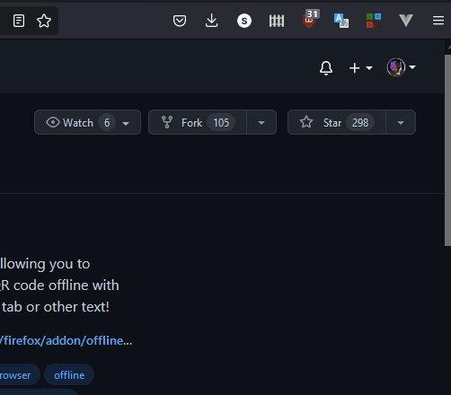
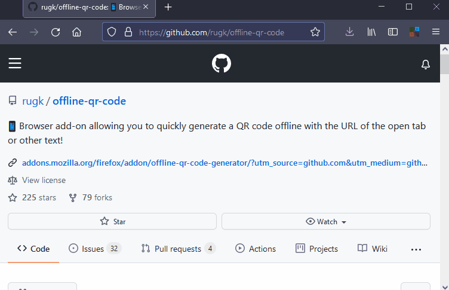

# Offline QR Code Generator 

This is a (Firefox) Web Extension, which makes it possible to generate a QR code from any website.

In contrast to many other add-ons, which use Google Web APIs for that, this add-on works completely offline. **This QR code generator puts your privacy first!**  
Effectively, the add-on [prevents any web connection](src/manifest.json#L33) for itself, so it does never contact the web. Thanks to the linked `manifest.json` you can also easily verify, that this claim is true. It works offline! Always.

It has a radically **simple, yet powerful** interface, allowing you to tweak many things in the settings, but being lightweight when you use it. A powerful usability improvement is the feature to **just resize the QR code** with your mouse by dragging and dropping. It's **lightweight** size also make it fast and easy to install – even on mobile connections.

It is inspired by [the old Offline QR code generator add-on](https://github.com/catholicon/OfflineQR) for Firefox 56 and lower. This extension only works with modern Firefox versions.

## Download

****

## In action…

See:
* [More screencasts](assets/screencasts)
* [More screenshots](assets/screenshots)

## Features
* Puts privacy first! Privacy is the default here, so it is generating QR codes offline.
* Follows [Firefox Photon Design](https://design.firefox.com/photon/welcome.html).
* Has a simple, but intuitively and usable User Interface.
* Uses up-to-date, great and customizable [QR code](https://github.com/nayuki/QR-Code-generator) [libraries](https://larsjung.de/kjua/).
* You can generate and save QR codes as SVG or Canvas (PNG image)!
* Lets the user choose the size of the QR code and customize things.
* Complete internationalization (i18n).
* You can use a shortcut (Ctrl+Shift+F10) for generating the QR code.
* Generate QR codes from selected text on the website.
* Complete Unicode/UTF-8/Emoji support.
* Looks good on desktop and mobile devices, i.e. it is responsive!
* Translated in English and German already. [Contribute your own language!](CONTRIBUTING.md#Translations)
* Compatible with Firefox for Android
* Uses up-to-date features and APIs of Firefox for efficient and clean code.
* Settings are synced across devices.
* Settings can be managed by your administrator. (work in progress)

## Notes

”QR Code” is a registered trademark of DENSO WAVE.

## Support development

You can support the development of this add-on on Liberapay:  

